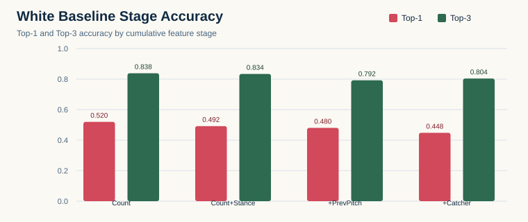
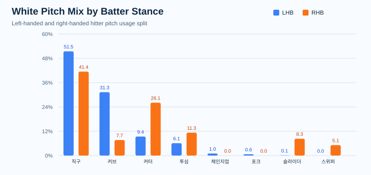
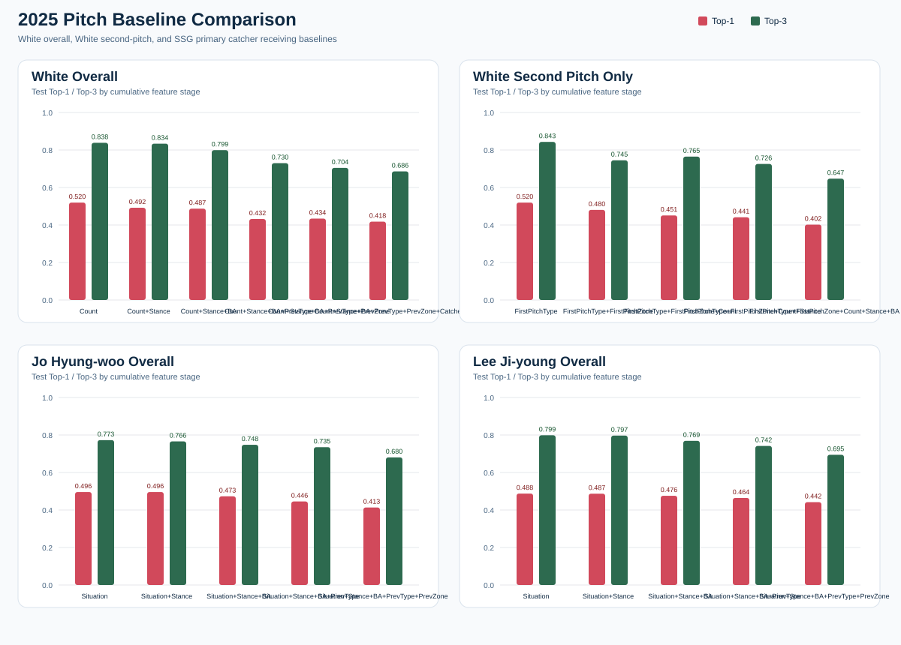
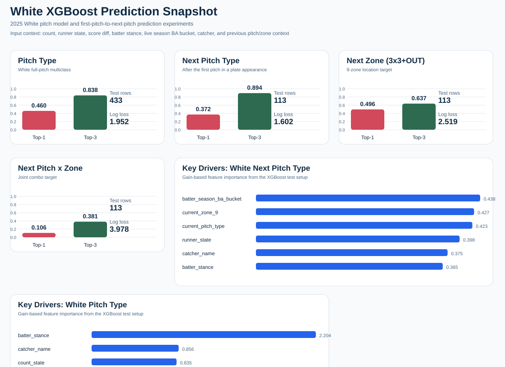
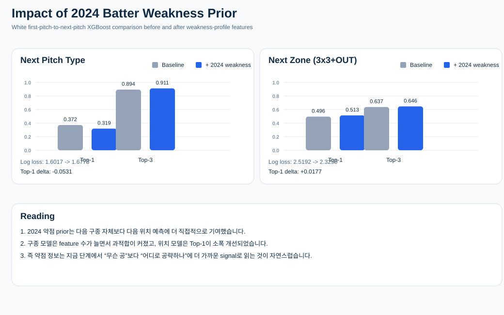
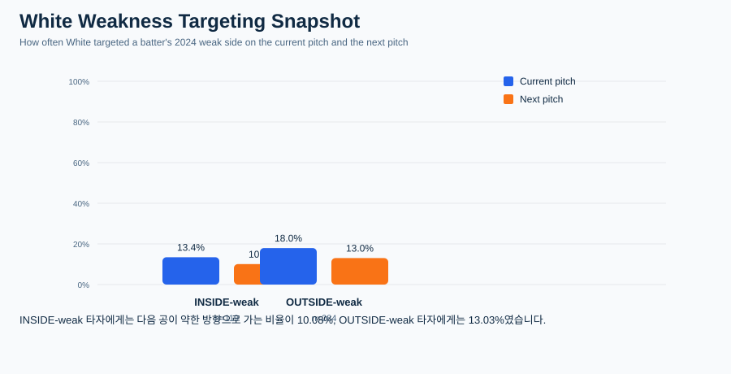

# KBO_VISION (WIP)

KBO 리그 경기 데이터 및 모든 투구 내용(구종, 위치좌표, 속도)을 Naver Sports API에서 수집하고, 향후 투구에 대한 실시간 예측 모델까지 구축하기 위해 개발 중인 프로젝트입니다. <br>
(사심으로) 한화와 류현진의 우승을 돕기위한 프로젝트

```text
Powered by Dabin Jeon
```

현재 기준으로 아래 범위까지 데이터 기반을 확보해 두었습니다.

- `2024` KBO 정규시즌 전체
- `2025-03-01`부터 `2025-10-31`까지의 시즌 범위 데이터
- 최신 일정 반영일: `2026-04-08` KBO 경기 정보

현재 분석 및 모델링에 바로 활용 가능한 대표 입력 규모는 아래와 같습니다.

- `2024` 시즌: `720`경기, `223,216`개 투구, `291`명 투수
- `2025` 시즌 범위 데이터: `720`경기, `217,857`개 투구, `281`명 투수
- `2026-04-08` 기준 시즌 진행 데이터: `50`경기, `16,036`개 투구, `167`명 투수

현재 프로젝트는 크게 네 축으로 진행되고 있습니다.

- 일정 / 경기 / relay 데이터 수집
- 투구 단위 테이블 생성
- 특정 투수 / 포수 matchup 분석
- next pitch baseline 모델 실험

## Data Scale Snapshot

현재까지 확보한 대표 데이터 규모는 아래와 같습니다.

- `2024` 정규시즌 schedule/game table 기준: `798`경기 row
- `2024` pitch-level 학습 입력 기준: `720`경기, `223,216`개 투구, `291`명 투수
- `2025` pitch-level 학습 입력 기준: `720`경기, `217,857`개 투구, `281`명 투수
- `2026-04-08` 기준 pitch-level 입력: `50`경기, `16,036`개 투구, `167`명 투수

즉 본 프로젝트는 일부 샘플 경기 분석이 아니라, 시즌 전체 수준의 pitch-level 데이터셋을 기반으로 확장 가능한 모델링을 목표로 하고 있습니다.

## Why This Project Is Interesting

이 프로젝트는 단순히 야구 데이터를 수집하는 저장소가 아닙니다.

실제로 풀고자 하는 질문은 아래와 같습니다.

- 특정 투수는 어떤 상황에서 어떤 구종을 선택하는가
- 특정 포수는 상황별로 어떤 볼배합 흐름을 만드는가
- 타자의 약점, 카운트, 주자상황, 점수차가 실제로 볼배합에 반영되는가
- 초구의 구종과 위치가 들어간 이후 2구는 어떻게 이어지는가

즉 이 프로젝트는 `기록 수집 -> 투구 해석 -> 다음 투구 예측`으로 이어지는 분석 파이프라인을 목표로 합니다.

## What You Can See

현재 저장소에서는 아래와 같은 결과를 직접 생성하고 확인하실 수 있습니다.

- 경기별 relay raw JSON과 pitch-level CSV
- strike zone 기반 pitch location SVG
- 투수 / 포수별 pitch mix 리포트
- 화이트 baseline 단계별 정확도 시각화
- 좌우타 상대 구종 분포 비교 차트
- 포수별 baseline 비교 실험 결과
- README에서 바로 확인할 수 있는 tracked SVG 예시

## Example Visuals

아래는 현재 프로젝트에서 생성 가능한 대표 예시입니다.

- 화이트 baseline 단계별 정확도 차트  
  
  
- 화이트 좌 / 우타 상대 구종 분포 차트  
  
  
- 화이트 / 조형우 / 이지영 baseline 비교 차트  
  
  
- 화이트 XGBoost 예측 스냅샷  
  
  
- 2024 타자 약점 prior 반영 전후 비교  
  
  
- 화이트의 약점 방향 공략률 스냅샷  
  
  

이러한 결과물은 단순한 시각 자료가 아니라, 실제로 아래와 같은 질문에 답하기 위한 분석 도구입니다.

- 화이트는 카운트 기반 루틴형인가
- 좌우타 반응형인가
- 포수에 따라 배합 흐름이 달라지는가
- 복잡한 상황 변수는 정말 예측력에 기여하는가

## XGBoost Snapshot

현재는 빈도 기반 baseline을 넘어서 XGBoost 기반의 1차 예측 실험까지 진행했습니다.

- 화이트 전체 구종 예측: `Top-1 0.4596`, `Top-3 0.8383`
- 화이트 초구 이후 다음 구종 예측: `Top-1 0.3717`, `Top-3 0.8938`
- 화이트 초구 이후 다음 위치 9분할 예측: `Top-1 0.4956`, `Top-3 0.6372`

현재 결과는 `초구가 어디에 어떤 구종으로 들어갔는지`와 `주자상황`, `타자 상태`, `포수` 정보가 다음 공 예측에 실제로 의미 있는 신호를 준다는 점을 보여줍니다.

## Weakness Prior Snapshot

`2024` 타자 약점 프로파일을 고정 prior로 만들고, 이를 `2025` 화이트의 `초구 -> 다음 공` 예측에 결합하는 실험도 추가했습니다.

- 약점 prior 추가 후 다음 구종 예측: `Top-1 0.3186`
- 약점 prior 추가 후 다음 위치 9분할 예측: `Top-1 0.5133`
- INSIDE-weak 타자 대상 다음 공 약점 방향 공략률: `10.08%`
- OUTSIDE-weak 타자 대상 다음 공 약점 방향 공략률: `13.03%`

현재까지는 `2024 약점 prior`가 다음 구종 자체보다 `다음 위치 예측`에 더 직접적으로 기여하고 있습니다. 즉 약점 정보는 지금 단계에서 `무슨 공인가`보다 `어디로 공략하는가`를 설명하는 signal에 더 가깝습니다.

## Current Scope

현재 구현된 범위는 아래와 같습니다.

- 날짜 범위별 KBO 일정 수집
- 시즌 / 날짜 범위 기준 경기별 relay raw 수집
- pitch-level CSV 생성
- catcher tracking 및 batter / pitcher / catcher 매핑
- strike zone 9분할 컨텍스트 생성
- 특정 투수 / 포수 전용 추출
- 모델용 테이블 생성
- 빈도 기반 baseline 실험

## Project Structure

```text
KBO_VISION/
├─ config/
├─ data/
│  ├─ matchups/
│  ├─ ranges/
│  ├─ schedule/
│  └─ seasons/
├─ plots/
├─ scripts/
├─ .gitignore
└─ README.md
```

## Main Scripts

### Data Collection

- `scripts/fetch_kbo_schedule.py`
  - 날짜 범위별 KBO 일정 CSV / JSON 생성
- `scripts/fetch_kbo_date_range.py`
  - 날짜 범위의 경기 raw / pitch 데이터 일괄 수집
- `scripts/fetch_kbo_season.py`
  - 시즌 전체 리그 경기 raw / pitch 데이터 일괄 수집
- `scripts/fetch_team_season.py`
  - 특정 팀 시즌 데이터 수집
- `scripts/test_naver_relay.py`
  - 단일 경기 relay raw / pitch CSV 생성

### Context And Matchup Analysis

- `scripts/extract_pitcher_profile.py`
  - 특정 투수 전용 pitch rows 및 요약 추출
- `scripts/extract_catcher_profile.py`
  - 특정 포수 전용 수신 pitch rows 및 요약 추출
- `scripts/build_pitch_context_table.py`
  - pitch-level context feature 생성
  - 이전 구종, 이전 존, 타석 / 이닝 / 경기 내 순서, 9분할 존 포함
- `scripts/augment_pitch_state_from_raw.py`
  - raw relay JSON에서 주자상황 / 점수차 복원
- `scripts/summarize_pitch_context.py`
  - 투수 / 포수 전용 descriptive summary 생성

### Modeling

- `scripts/build_model_tables.py`
  - 모델용 테이블 생성
  - 실시간 batter season stats
  - batter stance
  - runner state
  - score differential
  - previous pitch / zone
  - pitch family 포함
- `scripts/train_frequency_baseline.py`
  - 외부 라이브러리 없이 동작하는 빈도 기반 baseline
- `scripts/run_pitch_baseline_experiments.py`
  - 화이트 / 조형우 / 이지영 baseline 비교 실험
- `scripts/analyze_white_baseline.py`
  - 화이트 baseline 해석 리포트 및 SVG 차트 생성
- `scripts/render_experiment_comparison_svg.py`
  - 비교 실험 결과 SVG 시각화

### Visualization

- `scripts/plot_pitch_locations.py`
  - strike zone 기반 pitch location SVG 생성

## Recent Updates

이번 업데이트에서 반영된 핵심 항목은 아래와 같습니다.

- `requests.Session(trust_env=False)` 적용으로 프록시 환경 영향 제거
- 응답 UTF-8 강제 처리로 한글 깨짐 문제 완화
- `2024` 시즌 전체 수집 엔트리포인트 추가
- `2025 SSG 화이트` 전용 pitch profile 추출
- `SSG 조형우 / 이지영` 전용 catcher profile 추출
- strike zone 9분할 및 이전 투구 흐름 컨텍스트 추가
- raw relay 기반 `runner_state`, `score_diff_pitcher` 복원
- `pitcher routine`, `catcher situation`, `catcher batter-count` 모델 테이블 생성
- `pitch_type` multiclass와 `pitch_family` 이진 분류 baseline 실험 추가

## Modeling Direction

현재 모델 설계의 기본 방향은 아래 네 축을 함께 활용하는 것입니다.

- 장기 약점: `2024` 시즌 고정 타자 약점 프로파일
- 단기 상태: `2025` 현재 시점 직전 성적
- 현재 상황: 카운트, 주자상황, 점수차, 초구 위치, 직전 구종
- 호출 주체: 포수, 배터리 조합

추가로 타자 약점은 시즌이 진행될수록 `2025` 단기 상태의 비중을 높이는 blended 방식으로 확장할 계획입니다.

현재는 아래 두 모델 축을 함께 검토하고 있습니다.

- `pitch_type`를 그대로 맞히는 multiclass TOP1 예측
- `pitch_family` 기반의 속구계 / 변화구계 이진 예측

즉 세부 구종 예측은 유지하되, 보다 안정적인 상위 개념 분류도 함께 가져가는 방식입니다.

## Key Config Docs

- [PITCH_SEQUENCE_MODEL_PLAN.md](/c:/Users/Dabin%20Jeon/Documents/DevOps/KBO_VISION/config/PITCH_SEQUENCE_MODEL_PLAN.md)
- [WHITE_CATCHER_INFLUENCE_PLAN.md](/c:/Users/Dabin%20Jeon/Documents/DevOps/KBO_VISION/config/WHITE_CATCHER_INFLUENCE_PLAN.md)
- [MODEL_TABLE_PREP_PLAN.md](/c:/Users/Dabin%20Jeon/Documents/DevOps/KBO_VISION/config/MODEL_TABLE_PREP_PLAN.md)
- [RUNBOOK_2024_SEASON.md](/c:/Users/Dabin%20Jeon/Documents/DevOps/KBO_VISION/config/RUNBOOK_2024_SEASON.md)

## Example Commands

일정 수집 예시는 아래와 같습니다.

```powershell
python scripts\fetch_kbo_schedule.py --start-date 2026-04-08 --end-date 2026-04-08
```

2024 전체 시즌 수집 예시는 아래와 같습니다.

```powershell
python scripts\fetch_kbo_season.py --season-year 2024 --round-code kbo_r --reuse-existing
```

화이트 전용 추출 예시는 아래와 같습니다.

```powershell
python scripts\extract_pitcher_profile.py `
  --input-csv data\ranges\2025-03-01_2025-10-31\pitches_2025-03-01_2025-10-31.csv `
  --pitcher-code 55855 `
  --pitcher-name 화이트 `
  --team-code SK `
  --output-dir data\matchups\2025_white
```

모델 비교 실험 예시는 아래와 같습니다.

```powershell
python scripts\run_pitch_baseline_experiments.py `
  --white-csv data\models\model_pitcher_routine_white_2025.csv `
  --jo-csv data\models\model_catcher_batter_count_jo_2025.csv `
  --lee-csv data\models\model_catcher_batter_count_lee_2025.csv `
  --output-json data\models\pitch_baseline_comparison_2025.json
```

## Notes

- `data/` 아래 산출물은 분석 결과물 성격이 강하므로 git 추적에서 제외합니다.
- 버전 관리는 코드와 config 문서를 중심으로 진행합니다.
- 현재 baseline은 frequency 기반이므로 복잡한 상호작용에서는 과적합이 쉽게 발생할 수 있습니다.
- 다음 단계는 `2024 batter weakness profile` 구축과 더 강한 분류 모델 도입입니다.

## Current Status Snapshot

현재까지 확인한 분석 방향은 아래와 같습니다.

- 화이트는 `볼카운트` 기반 루틴 신호가 강하게 나타납니다.
- 좌 / 우타에 따라 구종 mix 차이가 분명하게 나타납니다.
- 포수 전체 수신 데이터에서도 상황별 패턴이 확인됩니다.
- 다만 `주자상황 + 점수차 + 직전 위치`까지 모두 넣는 순간 frequency baseline은 쉽게 과적합됩니다.
- 따라서 다음 단계는 더 강한 학습기와 `2024 타자 약점 프로파일`의 결합입니다.

## Tomorrow Fun Board

아래 보드는 README용 재미 요소로 넣은 예시입니다.

- 기준: `2026-04-08` 한화 선발 라인업이 다음 경기에도 유지된다고 가정
- 상대: `SSG 화이트`
- 카드 내용: 타자별 `유력 초구`, `유력 2구`, `유력 타석 결과`
- 기준 데이터: `화이트 2025 투구 기록 + 포수 영향 + 2025 시즌 live 타자 약점`
- 성격: 실험적 예시이며, 실제 라인업과 경기 흐름에 따라 달라질 수 있습니다.


