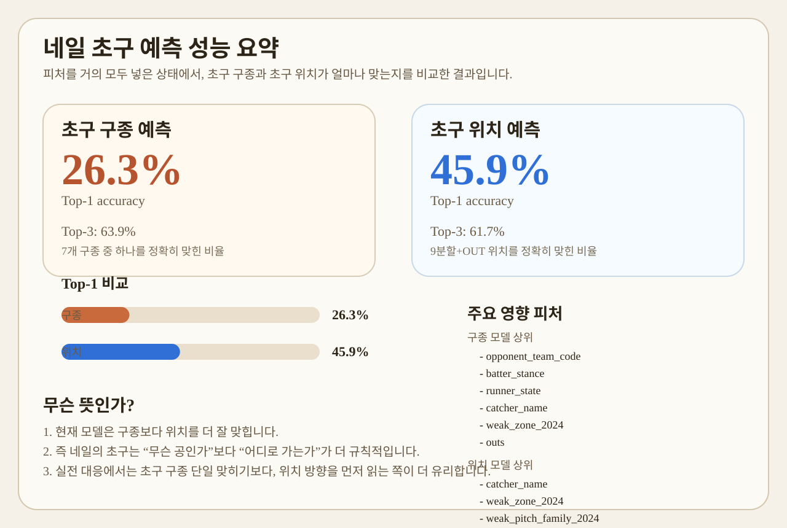
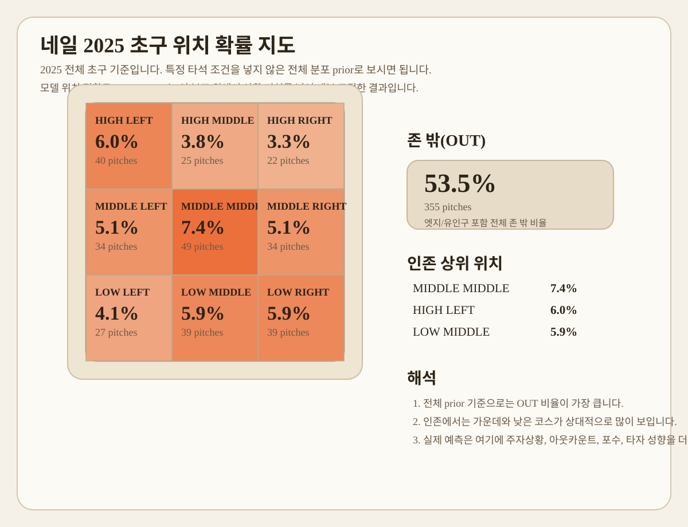
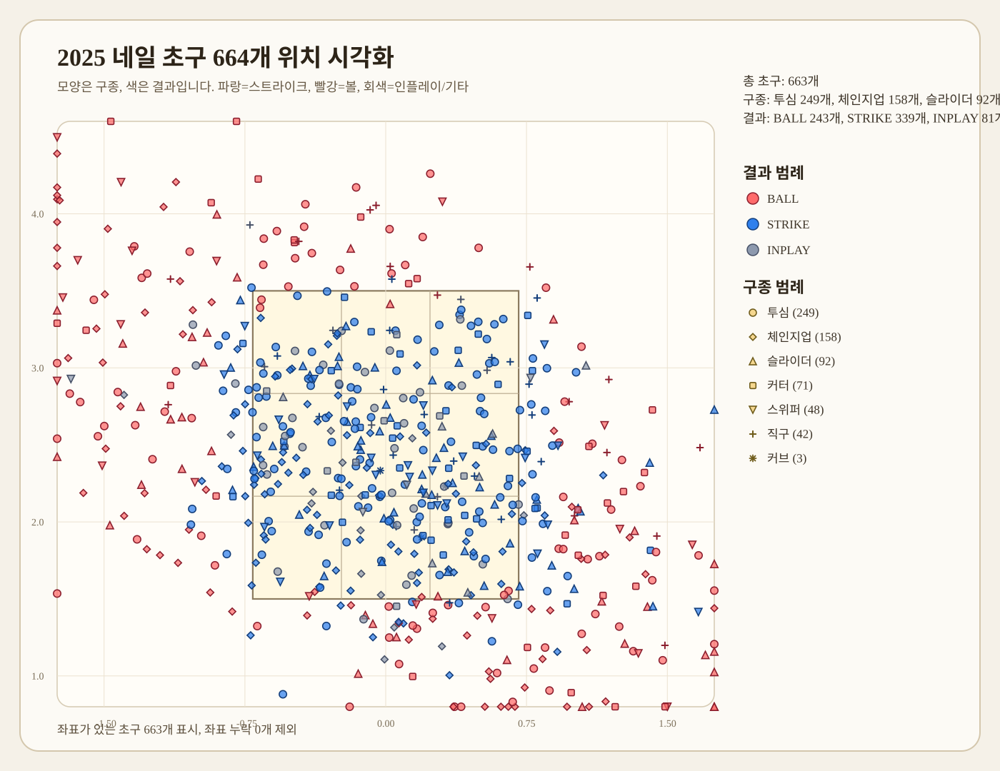
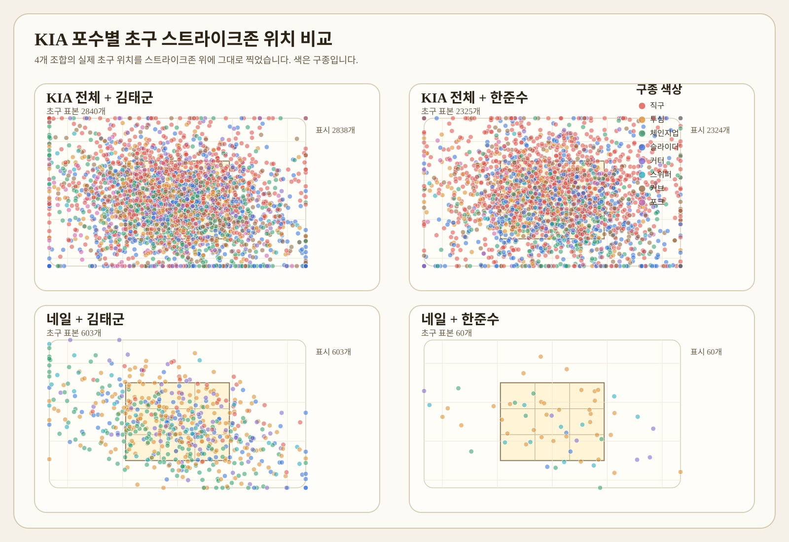
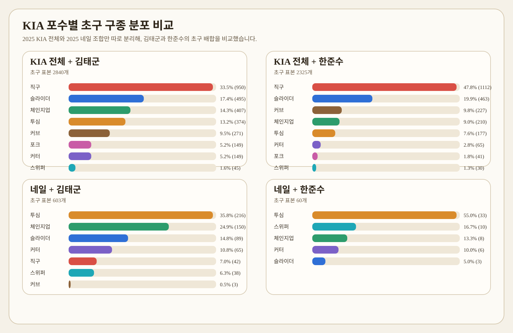
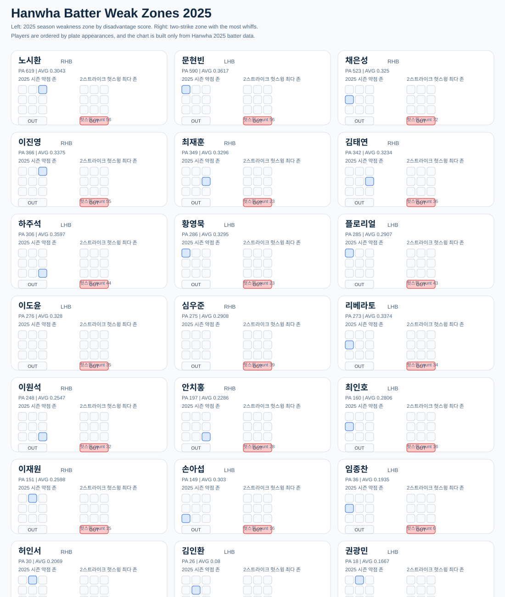
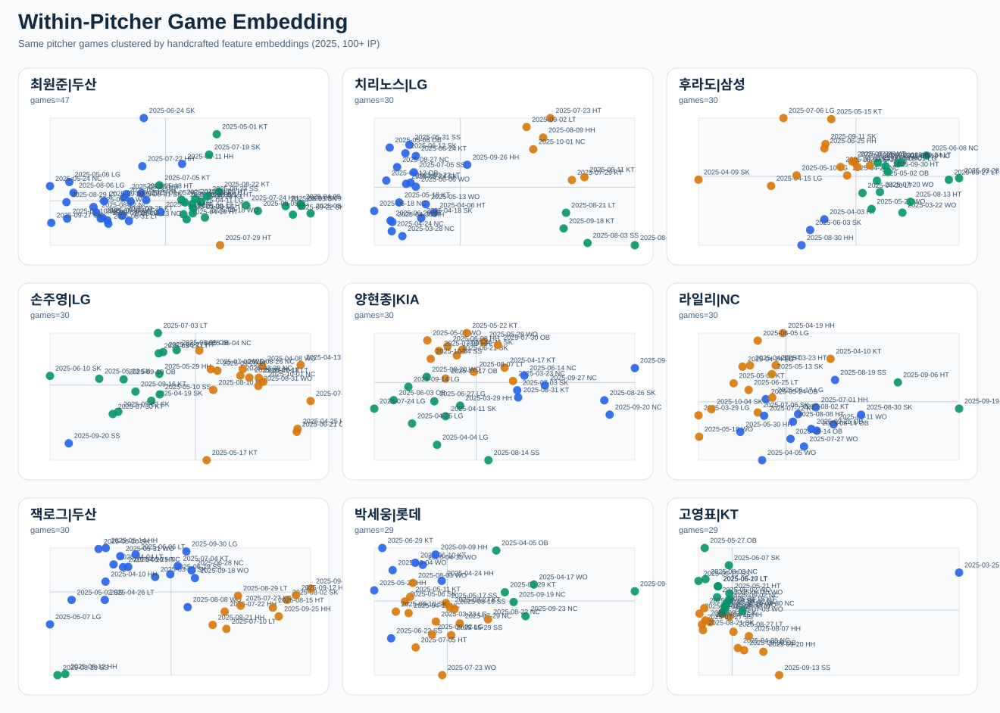
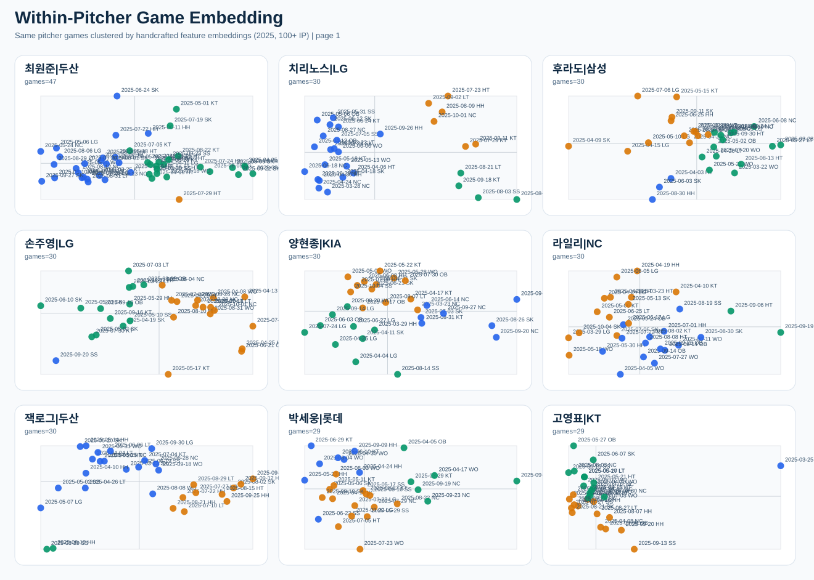
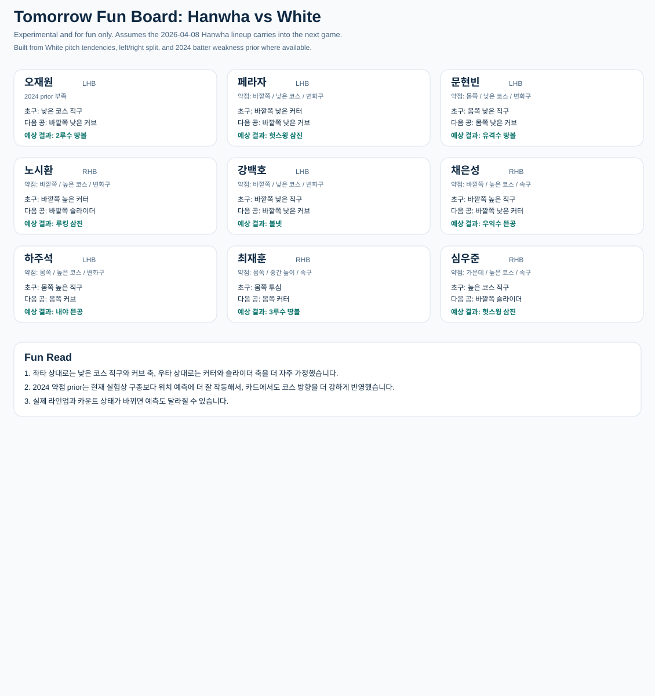

# KBO_VISION (WIP)

KBO 리그 경기 데이터 및 모든 투구 내용(구종, 위치좌표, 속도)을 Naver Sports API에서 수집하고, 향후 투구에 대한 실시간 예측 모델까지 구축하기 위해 개발 중인 프로젝트입니다. <br>
(사심으로) 한화와 류현진의 우승을 돕기위한 프로젝트

```text
Powered by Dabin Jeon
```

현재 본 저장소는 아래 범위까지 데이터 기반 분석이 가능한 상태입니다.

- `2024` KBO 정규시즌 전체
- `2025` 시즌 전체 범위 데이터
- `2026-04-08` 기준 최신 일정 및 일부 실시간 데이터

데이터 규모는 아래와 같습니다.

- `2024`: `720`경기, `223,216`개 투구, `291`명 투수
- `2025`: `720`경기, `217,857`개 투구, `281`명 투수
- `2026-04-08` 기준: `50`경기, `16,036`개 투구, `167`명 투수

## 프로젝트 핵심

본 프로젝트는 단순 기록 수집이 아니라, 투구를 `타석`, `이닝`, `경기 전체` 시퀀스로 해석하고 다음 공의 구종과 위치를 예측하는 것을 목표로 합니다.

현재 중점 질문은 아래와 같습니다.

- 특정 투수는 어떤 상황에서 어떤 구종을 선택하는가
- 포수, 배터리 조합, 상대 타자 특성이 볼배합에 얼마나 영향을 주는가
- 타자의 시즌 성적, 약점 존, 초구 스윙 성향이 실제 호출 패턴에 반영되는가
- 초구와 직전 구종, 볼카운트, 주자상황이 다음 공 선택에 어떤 규칙을 만드는가

## 현재 모델 상태

현재까지의 실험을 종합하면, `세부 구종 multiclass를 단번에 맞히는 방식`보다 `baseline prior를 먼저 깔고 상황 피처로 보정하는 방식`이 더 잘 작동합니다.

특히 오늘 정리된 핵심은 아래와 같습니다.

- 네일 `2025` 초구 구종 예측에서 단순 majority baseline은 `0.3684`
- baseline prior를 row-level feature로 붙인 뒤 `xgboost random-forest mode`는 `0.3985`
- 즉 초구 모델은 `baseline 기반 보정 구조`가 실제로 baseline을 넘기기 시작했습니다
- 네일 `2025` 전체 투구 구종 예측에서는 `count_state + prev_pitch_type_pa_1` 조건부 baseline이 `0.3168`
- 전체 투구 학습 모델 중 최고는 `xgboost random-forest mode 0.3109`
- 따라서 전체 투구에서는 아직 `볼카운트 + 직전 구종` 규칙이 가장 강한 설명력을 보입니다

한 줄로 정리하면, 현재 프로젝트는 `baseline을 명시적으로 feature로 넣는 계층형 예측 구조`로 가는 것이 맞다는 판단입니다.

## Sequence Roadmap

현재 프로젝트의 다음 단계는 투구를 `이벤트`가 아니라 `시퀀스`로 재구성하는 것입니다.

우선 대상은 아래로 고정합니다.

- `2025` 시즌
- 공식 KBO 투수 기본기록 기준 `100이닝 이상` 투수

시퀀스 레이어는 4개로 구성합니다.

- `pitch_master`
  - 1행 = 1투구
- `pa_sequence_table`
  - 1행 = 1타석
- `inning_sequence_table`
  - 1행 = 1이닝
- `game_sequence_table`
  - 1행 = 1경기

핵심 원칙은 아래와 같습니다.

- 위치는 반드시 포함
- 구종 시퀀스와 위치 시퀀스를 동시에 보관
- 투수, 포수, 팀, 상대팀, 타자, 타순, 직전년도/해당시즌 타율을 헤더 메타데이터로 포함
- 가능한 한 동일한 공통 스키마를 유지

현재 표준 위치 코드는 `A1 ~ E5` 25분할입니다.

예시:

- `pitch_seq = TUS`
- `zone25_seq = C3-D5-E5`
- `pitch_zone_seq = TC3-UD5-SE5`

즉 한 타석은 구종만이 아니라 `구종+위치`의 서열로 저장됩니다.

예시 형태는 아래와 같습니다.

```text
[pitch_master]
game_id      inning  batter   pitch_no_pa  pitch_type  zone25  result
20250410...  1       오재원   1            T           C3      strike
20250410...  1       오재원   2            U           D5      ball
20250410...  1       오재원   3            S           E5      whiff

[pa_sequence_table]
game_id      inning  pitcher  catcher  batter   lineup_slot  prev_ba  curr_ba  pitch_seq  zone25_seq  pitch_zone_seq  final_result
20250410...  1       네일     김태군   오재원   1            0.000    0.287    TUS        C3-D5-E5    TC3-UD5-SE5     strikeout

[PA FASTA-like]
>pa_id=PA0001|game_id=20250410...|pitcher=네일|catcher=김태군|batter=오재원|lineup=1|prev_ba=0.000|curr_ba=0.287|inning=1|outs=0|runner=000|result=strikeout
PITCH:TUS
ZONE:C3-D5-E5
PAIR:TC3-UD5-SE5
```

이 시퀀스는 이후 두 형태로 함께 관리할 예정입니다.

- CSV 테이블
  - 모델링, 필터링, 집계용
- FASTA-like 텍스트
  - motif, n-gram, sequence pattern 분석용

관련 설계 문서:

- [SEQUENCE_SCHEMA_PLAN.md](config/SEQUENCE_SCHEMA_PLAN.md)

시퀀스 분석은 우선 아래 순서로 시작합니다.

- `PA sequence` 기준 투수별 top motif
- `2스트라이크` 종료 패턴
- `좌타/우타`별 motif 차이
- `pitch_zone_seq` 기준 위치 포함 motif
- 그다음 투수 유형 군집화

처음 확인할 결과물은 아래 4개입니다.

- 투수별 top 10 `pitch_seq`
- 투수별 top 10 `pitch_zone_seq`
- `2스트라이크` top motif
- `좌/우타 split motif table`

현재 생성된 산출물:

- [sequence_motif_report_2025_100ip.md](data/sequences/2025_100IP/analysis/sequence_motif_report_2025_100ip.md)
- [pitch_seq_top10_by_pitcher_2025_100ip.csv](data/sequences/2025_100IP/analysis/pitch_seq_top10_by_pitcher_2025_100ip.csv)
- [pitch_zone_seq_top10_by_pitcher_2025_100ip.csv](data/sequences/2025_100IP/analysis/pitch_zone_seq_top10_by_pitcher_2025_100ip.csv)
- [two_strike_top_motif_2025_100ip.csv](data/sequences/2025_100IP/analysis/two_strike_top_motif_2025_100ip.csv)
- [stance_split_motif_2025_100ip.csv](data/sequences/2025_100IP/analysis/stance_split_motif_2025_100ip.csv)

## 최근 시퀀스 분석 업데이트

`2025` 시즌 `100이닝 이상` 투수를 기준으로, 투구를 `PA / 이닝 / 경기` 3단 시퀀스로 재구성하고 아래 분석까지 확장했습니다.

- `모티프분석`: 투수별 대표 `pitch_seq`, `pitch_zone_seq`, 2스트라이크 motif, 좌/우타 split motif
- `규칙분석`: `pitch_result_seq`, `count_path + pitch_seq`, `pitch_zone + result` 조합 규칙
- `거리분석`: `Levenshtein`, `Needleman–Wunsch`, `Smith–Waterman` 기반 거리 비교
- `클러스터분석`: 경기 embedding, 동일 투수 경기 clustering, cluster characteristics
- `경기반복분석`: 같은 투수의 여러 경기 사이에서 반복되는 운영 패턴과 유사 경기쌍 탐색

분석 결과는 `data/sequences/2025_100IP/analysis` 아래를 한글 폴더 기준으로 정리했습니다.

- [분석결과_안내.md](data/sequences/2025_100IP/analysis/분석결과_안내.md)
- [클러스터분석](data/sequences/2025_100IP/analysis/클러스터분석)
- [거리분석](data/sequences/2025_100IP/analysis/거리분석)
- [모티프분석](data/sequences/2025_100IP/analysis/모티프분석)
- [규칙분석](data/sequences/2025_100IP/analysis/규칙분석)
- [경기반복분석](data/sequences/2025_100IP/analysis/경기반복분석)

의미 있게 확인된 결과는 아래와 같습니다.

- `오원석`은 같은 경기 안에서 반복되는 PA motif 기준으로 `FF` 패턴 빈도가 가장 높았습니다.
- `류현진`은 시즌 경기들이 `직구-커브 반복형`, `커브 진입형`, `체인지업 연속형`의 3개 운영 클러스터로 나뉘는 흐름을 보였습니다.
- 거리 기반 비교에서는 `Smith–Waterman`이 부분 패턴 재사용을 가장 민감하게 잡았고, `Needleman–Wunsch`는 더 엄격한 전역 정렬 기준으로 작동했습니다.
- 동일 투수 경기 embedding은 경기별 운영 스타일을 군집으로 나누는 데 유효했고, 페이지별 SVG로 모든 100+ IP 투수를 확인할 수 있도록 정리했습니다.

대표 결과물:

- [within_pitcher_game_embedding_2025_100ip.svg](data/sequences/2025_100IP/analysis/클러스터분석/within_pitcher_game_embedding_2025_100ip.svg)
- [페이지별 SVG](data/sequences/2025_100IP/analysis/클러스터분석/페이지별)
- [within_pitcher_cluster_characteristics_2025_100ip.md](data/sequences/2025_100IP/analysis/클러스터분석/within_pitcher_cluster_characteristics_2025_100ip.md)
- [within_pitcher_game_similarity_report_2025_100ip.md](data/sequences/2025_100IP/analysis/경기반복분석/within_pitcher_game_similarity_report_2025_100ip.md)
- [game_distance_matrix_pairs_2025_100ip.csv](data/sequences/2025_100IP/analysis/거리분석/game_distance_matrix_pairs_2025_100ip.csv)

## 오늘 분석 요약

`2026-04-10` 기준 네일 분석에서 확인된 내용은 아래와 같습니다.

- 초구 구종은 `상대팀`, `주자상황`, `아웃카운트`, `포수`, `타자 좌우`, `타자 초구 성향`에 따라 달라집니다
- 다만 `초구 exact pitch type`은 여전히 어려운 문제이고, `초구 위치`는 상대적으로 더 잘 맞습니다
- 네일 초구는 초반 이닝에서 `투심` 중심성이 강하고, 중반 이후 `체인지업`과 다른 변화구가 더 많이 섞입니다
- 한화 상대에서는 특정 타자에게 `체인지업 초구`가 집중된 패턴이 보였습니다
- 전체 투구 모델에서는 `볼카운트`, `직전 구종`, `주자상황`, `이닝`, `포수`가 핵심 축으로 작동합니다

## Example Visuals

### 네일 초구 모델 성능 요약



### 네일 초구 전체 위치 확률 지도



### 네일 초구 실제 위치 산포도



### KIA 포수별 초구 스트라이크존 비교



### KIA 포수별 초구 구종 분포 비교



### 한화 타자 2025 약점 존 요약



### 100이닝 이상 투수 경기별 운영 클러스터 요약



### 100이닝 이상 투수 경기별 운영 클러스터 페이지 예시



## 2026.04.10 선발투수 "네일" 예측

기준: 네일 `2025` 실제 투구 패턴, 포수 영향, 타자 성향, 그리고 baseline prior 기반 시나리오



## 주요 스크립트

- [fetch_kbo_schedule.py](scripts/fetch_kbo_schedule.py)
- [fetch_kbo_season.py](scripts/fetch_kbo_season.py)
- [build_pitch_context_table.py](scripts/build_pitch_context_table.py)
- [build_model_tables.py](scripts/build_model_tables.py)
- [build_first_pitch_driver_table.py](scripts/build_first_pitch_driver_table.py)
- [build_all_pitch_driver_table.py](scripts/build_all_pitch_driver_table.py)
- [augment_first_pitch_baseline_priors.py](scripts/augment_first_pitch_baseline_priors.py)
- [benchmark_first_pitch_algorithms.py](scripts/benchmark_first_pitch_algorithms.py)

## 관련 문서

- [PITCH_SEQUENCE_MODEL_PLAN.md](config/PITCH_SEQUENCE_MODEL_PLAN.md)
- [FIRST_PITCH_MODEL_ARCHITECTURE_RECOMMENDATION.md](config/FIRST_PITCH_MODEL_ARCHITECTURE_RECOMMENDATION.md)
- [ALGORITHM_SELECTION_POLICY.md](config/ALGORITHM_SELECTION_POLICY.md)
- [HANWHA_DAILY_TABLES_PLAN.md](config/HANWHA_DAILY_TABLES_PLAN.md)
- [SEQUENCE_SCHEMA_PLAN.md](config/SEQUENCE_SCHEMA_PLAN.md)

## 실행 예시

```powershell
python scripts\fetch_kbo_season.py --season-year 2024 --round-code kbo_r --reuse-existing
python scripts\build_first_pitch_driver_table.py --input-csv ... --weakness-csv ... --swing-csv ... --pitcher-team-code HT --output-csv ...
python scripts\benchmark_first_pitch_algorithms.py --input-csv ... --target first_pitch_type --output-json ...
```

## Note

- `data/` 아래 원본 산출물은 대부분 git 추적에서 제외합니다
- 버전 관리는 코드, 문서, 예시 SVG 중심으로 유지합니다
- 현재 모델은 `baseline을 이기는가`를 가장 중요한 평가 기준으로 둡니다
